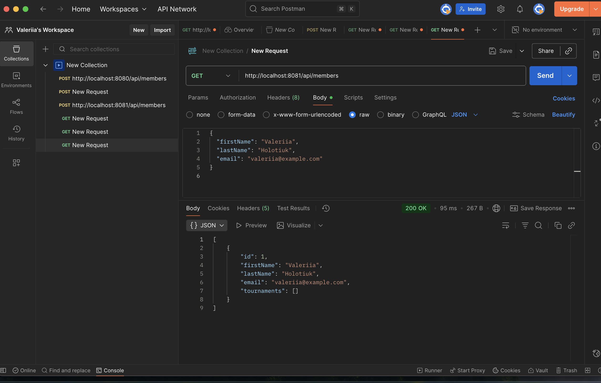
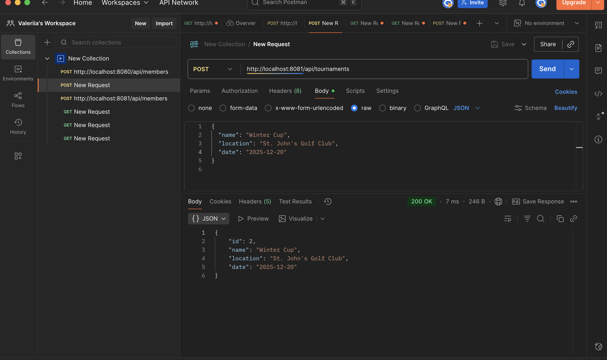
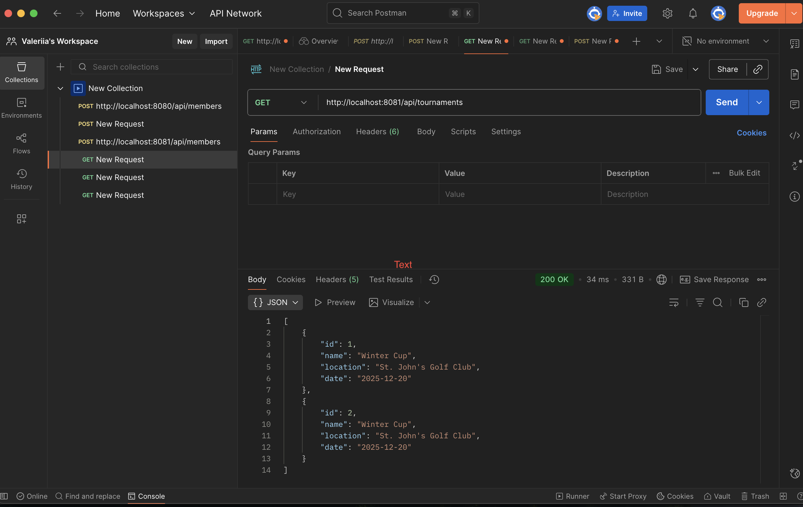

# qap_4
SOFTWARE DESIGN, ARCHITECTURE & TESTING
Quantitative Assessment Practice (QAP 4)
Golf Club Tournament & Membership API

Student: Valeriia Holotiuk
Course: Software Design, Architecture & Testing

1. Introduction
This project implements a complete REST API using Java Spring Boot, JPA, PostgreSQL, and Docker, based on the requirements of the Software Developer Course Assessment: Quantitative Assessment Practice (QAP 4). The API manages golf club members and tournaments, supports CRUD operations, tournament registration, search capabilities, Docker containerization, and initial deployment steps toward AWS RDS.

2. Project Features

2.1 Member Features
Each Member includes:
- ID 
- Name
- Address
- Email
- Phone Number
- Membership Start Date
- Membership Duration 

Member Endpoints:
POST /api/members — Create a new member
GET /api/members — Retrieve all members
GET /api/members/{id} — Retrieve member by ID
GET /api/members/search — Search members

Search filters:
- name
- phone
- membership start date

2.2 Tournament Features
Each Tournament includes:
- ID 
- Start Date
- End Date
- Location
- Entry Fee
- Cash Prize Amount
- Participating Members (Many-to-Many)

Tournament Endpoints:
POST /api/tournaments — Create tournament
GET /api/tournaments — Retrieve tournaments
GET /api/tournaments/{id} — Retrieve tournament by ID
POST /api/tournaments/{tournamentId}/register/{memberId} — Register member
GET /api/tournaments/search — Search tournaments

Search filters:
- start date
- location

3. Architecture Overview
The application follows a clean layered structure:
Controller → Service → Repository → Model → Database

4. Running Locally

Prerequisites:
- Java 17+
- Maven
- PostgreSQL

Database Setup:
CREATE DATABASE golfclubdb;
CREATE USER golfuser WITH PASSWORD 'golfpass';
GRANT ALL PRIVILEGES ON DATABASE golfclubdb TO golfuser;

application.properties:
spring.datasource.url=jdbc:postgresql://localhost:5432/golfclubdb
spring.datasource.username=golfuser
spring.datasource.password=golfpass
spring.jpa.hibernate.ddl-auto=update

Run:
mvn spring-boot:run

5. Docker Support

Dockerfile included allowing the API to run without local Java or PostgreSQL setup.

docker-compose.yml:
Includes:
- PostgreSQL container
- Spring Boot API container
- Shared network + environment variables

Run with Docker:
mvn clean package -DskipTests
docker-compose up --build

6. AWS RDS Deployment Steps

7. Postman Testing (Screenshots Provided)
- Create Member
- Get Members

- Search Members
- Create Tournament

- Search Tournaments

8. Deliverables Checklist
✔ GitHub repo
✔ Working API
✔ Search endpoints
✔ Registration endpoint
✔ Dockerfile + docker-compose.yml
✔ Screenshots
✔ AWS RDS attempt
✔ Full README 

9. GitHub Link
https://github.com/ValeriiaHolotiuk/qap_4
